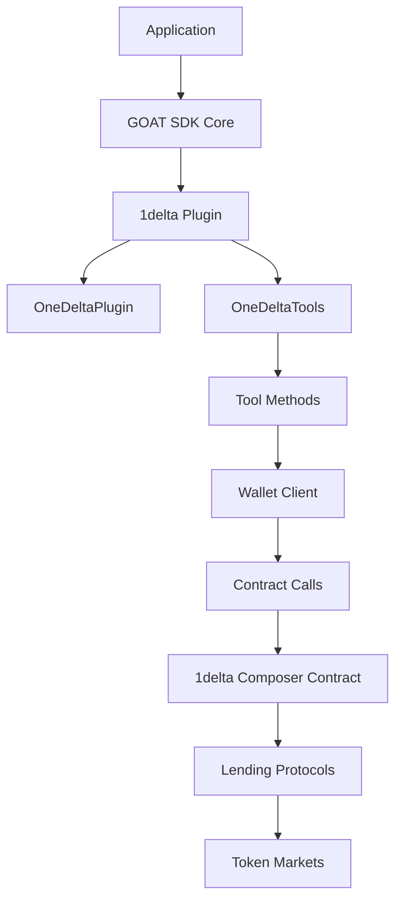

# 1delta Margin Trading Example

This example demonstrates how to use the 1delta plugin with the GOAT SDK to interact with 1delta's margin trading protocol across multiple EVM chains. It provides both a CLI interface and an AI-powered assistant for interacting with the protocol.

## Features

- **Multi-Chain Support**: Works with Arbitrum, Ethereum, Optimism, Base, Polygon, and BNB Chain
- **CLI Mode**: Command-line interface for direct interaction with the protocol
- **AI Assistant Mode**: Natural language interface powered by OpenAI's GPT models
- **Balance Checking**: View collateral and debt balances for different tokens
- **Health Factor**: Monitor your position's health factor
- **Token Information**: Get information about supported tokens

## Architecture



## Prerequisites

- Node.js 18+
- pnpm
- Private key for an Ethereum wallet
- RPC URLs for the chains you want to use

## Setup

1. Create a `.env` file with the following variables:
   ```
   WALLET_PRIVATE_KEY=0x...
   ARBITRUM_RPC_URL=https://...
   ETHEREUM_RPC_URL=https://...
   OPTIMISM_RPC_URL=https://...
   BASE_RPC_URL=https://...
   POLYGON_RPC_URL=https://...
   BNB_RPC_URL=https://...
   OPENAI_API_KEY=sk-...
   ```

2. Install dependencies:
   ```
   pnpm install
   ```

3. Run the example:
   ```
   pnpm start [chain]
   ```
   Where `[chain]` is one of: `arbitrum`, `ethereum`, `optimism`, `base`, `polygon`, `bnb`. If not specified, it defaults to `arbitrum`.

## Usage

### CLI Mode

The CLI mode provides the following commands:

- `get-tokens`: Get the list of supported tokens
- `get-chain`: Get information about the current chain
- `get-collateral <token>`: Get the collateral balance for a token
- `get-debt <token>`: Get the debt balance for a token
- `get-health`: Get the health factor
- `ai`: Switch to AI assistant mode
- `exit`: Exit the program

### AI Assistant Mode

In AI assistant mode, you can ask questions in natural language, such as:

- "What is my collateral balance for USDC?"
- "Show me my debt balance for ETH"
- "What's my health factor?"
- "What tokens are supported?"
- "Tell me about the current chain"

Type `cli` to switch back to CLI mode or `exit` to quit.

## Code Structure

- `index.ts`: Main entry point and implementation
- `types.d.ts`: Type declarations for external modules
- `package.json`: Dependencies and scripts
- `.env`: Environment variables (not included in repo)

## Dependencies

- `@ai-sdk/openai`: OpenAI integration for AI SDK
- `ai`: Vercel AI SDK for AI assistant functionality
- `@goat-sdk/plugin-1delta`: 1delta plugin for GOAT SDK
- `@goat-sdk/wallet-viem`: Viem wallet adapter for GOAT SDK
- `viem`: Ethereum interaction library
- `zod`: Schema validation library
- `dotenv`: Environment variable loading

## License

MIT 